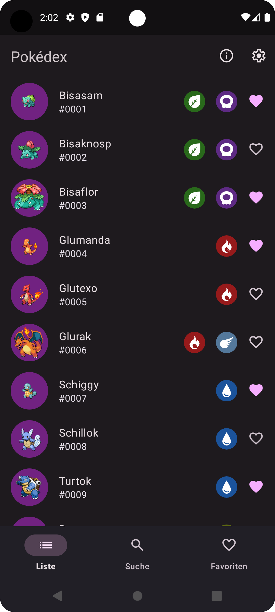
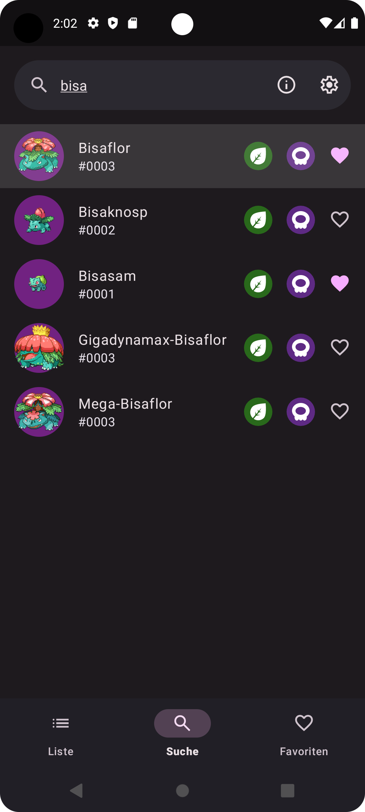
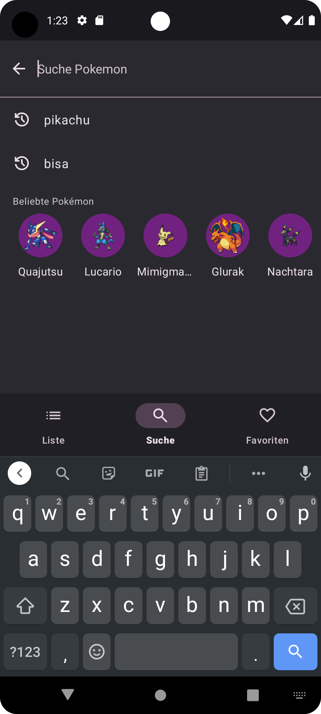
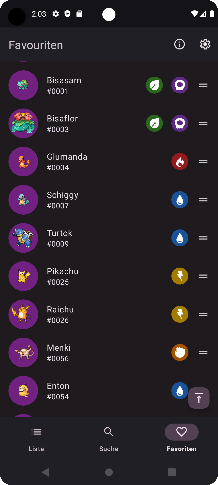
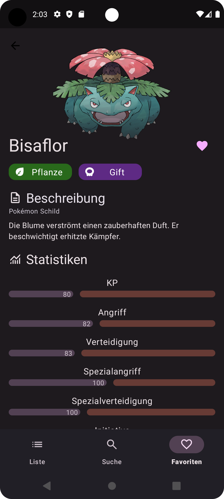

# Pokedex App

Welcome to my **Pokedex App** – a simple Android application that showcases my development skills with modern technologies and tools in the Android ecosystem.

## Overview

This simple Pokemon App was build with a clean and modular architecture using Kotlin and following Material Design 3 guidelines.
It's designed to provide a smooth and responsive user experience, while also being a demonstration of my proficiency with modern Android development practices.

## Features
- **Pokémon Information:** Browse through a list of Pokémon, complete with images, types, and detailed descriptions.
- **GraphQL Integration:** Uses Apollo to fetch Pokémon data from [PokeAPI's GraphQL API](https://pokeapi.co/docs/graphql).
- **Favourites:** Mark Pokémon as favorites.
- **Room Database:** Favourite Pokémon are stored locally using Room to provide offline access.
- **Modern Design Principles:** UI designed with Material Design 3 guidelines.
- **Efficient Image Loading:** Uses Coil for efficient image loading and caching.
- **Pagination:** Implements Paging3 to load Pokémon data seamlessly and efficiently.
- **Dependency Injection:** Utilizes Dagger/Hilt to manage dependencies.

## Technologies Used

- **Language:** [Kotlin](https://kotlinlang.org/)
- **Build System:** [Gradle](https://gradle.org/)
- **Data Layer:** [Apollo](https://www.apollographql.com/docs/kotlin) (GraphQL), [Room Database](https://developer.android.com/jetpack/androidx/releases/room) (SQL)
- **Dependency Injection:** [Dagger/Hilt](https://developer.android.com/training/dependency-injection/hilt-android)
- **Image Loading:** [Coil](https://coil-kt.github.io/coil/)
- **Pagination:** [Paging3](https://developer.android.com/topic/libraries/architecture/paging/v3-overview)
- **Design Framework:** [Material Design 3](https://m3.material.io/)

## Planned Improvements

- **Code Refinements:** Further optimize code structure.
- **Caching Enhancements:** Add propper caching mechanisms to reduce load times for PokeAPI.

## Why This Project?

This project was created to demonstrate my ability to:

- Build scalable Android apps using the latest SDKs and tools.
- Apply best practices in architecture and dependency management.
- Work with a variety of libraries to enhance the user experience and app performance.
- Follow modern UI/UX guidelines to deliver visually appealing interfaces.

## Screenshots

| Home Fragment                                   | Search Fragment                                     | Search Fragment (Suggestions)                                  | Favourites Fragment                                         | Details Fragment                                      |
|-------------------------------------------------|-----------------------------------------------------|----------------------------------------------------------------|-------------------------------------------------------------|-------------------------------------------------------|
|  |  |  |  |  |

## Additional References
- **Type Colors:** [bulbapedia.bulbagarden.net](https://bulbapedia.bulbagarden.net/wiki/Category:Type_color_templates)
- **Type Drawables:** [pokemon-type-svg-icons](https://github.com/duiker101/pokemon-type-svg-icons/tree/master)
- **Icons:** [Google Fonts](https://fonts.google.com/icons)
